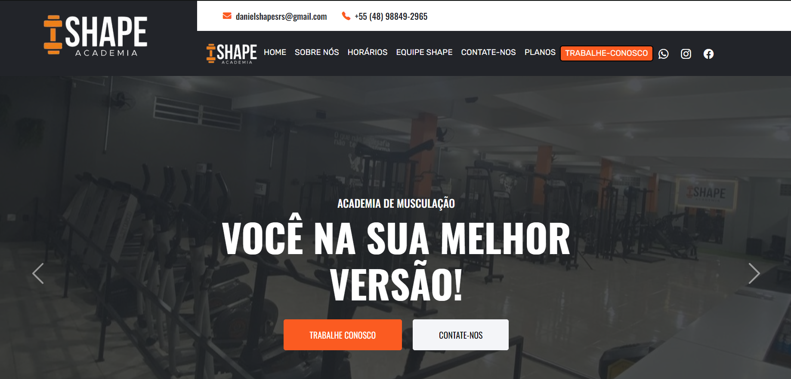
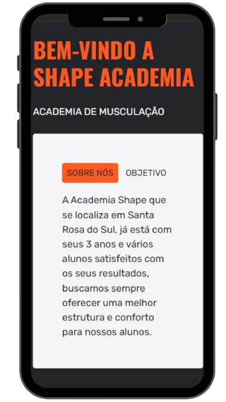
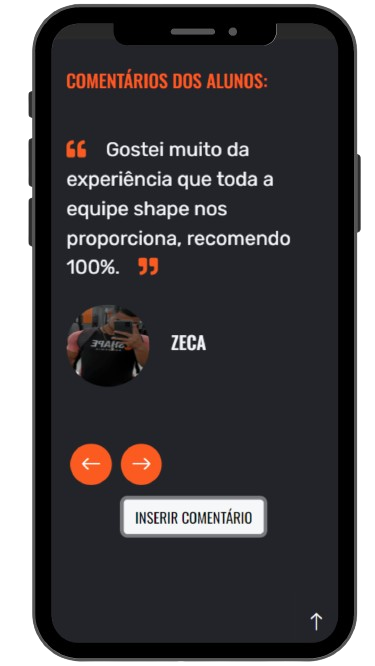
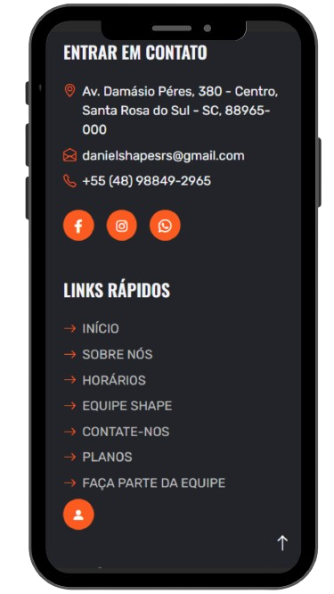
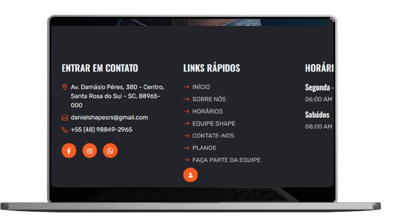

<h1 align="center">
    
</h1>

<h4 align="center"> 
💪   SHAPE ACADEMIA 💪 
</h4>

 •
 <a href="#-sobre-o-projeto">Sobre</a> •
<a href="#-principais-funcionalidades">Funcionalidades</a> •
 <a href="#-layout">Layout</a> • 
 <a href="#-tecnologias">Tecnologias</a> • 
 <a href="#-contribuidores">Contribuidores</a> 

<h2 id="-sobre-o-projeto">🔥 Sobre o Site</h2>

🏋️‍♂️ A necessidade de criar um site para a SHAPE ACADEMIA surgiu quando percebi a dificuldade em obter informações essenciais, como planos, horários e a identidade dos personal trainers. Dependia do Instagram para algumas informações, enquanto para outras precisava enviar mensagens ou até mesmo deslocar-me pessoalmente. Com o crescimento contínuo da academia, tornou-se praticamente obrigatório ter um site nos dias atuais.

Assim, surgiu a ideia de desenvolver um site que não apenas oferecesse todas essas informações de forma acessível, mas também incluísse uma sessão para inserção de comentários, facilitando a interação com os clientes e proporcionando uma experiência mais completa.

Confira o Software, <a href="https://shapeacademiasrs.com.br/" target="_blank">Shape Academia</a>

---

<h2 id="-principais-funcionalidades">⚙️ Principais Funcionalidades</h2>

 - [x] PÁGINA HOME: 

    - >VISUALIZAR :
        - História da Shape;
        - Ver Horários;
        - Equipe de Profissionais
        - Inserir Comentários,
        #####

- [x] PAINEL ADM: 

    - > VISUALIZAR:
        - Ver os Comentários;
        - Excluir Comentários;
        - Subir Comentários;
        - Alert de Comentários;
    #####
   

    
---

<h2 id="-layout">🎨 Layout</h2>

O layout do software busca ser claro, bonito e prático, além responsivo:
 -  <b>Obs:</b> Aqui é apenas uma ilustração, por isso não está 100% responsivo,

<h2 id="-mobile">Mobile</h2>

  

  

  

<h2 id="-web">Web</h2>

	
  

  

  

---

<h2 id="-tecnologias">🛠 Tecnologias</h2>

As seguintes Tecnologias foram usadas na construção do projeto:

-   **[PHP](https://www.php.net/manual/pt_BR/index.php)**
-   **[JAVASCRIPT](https://developer.mozilla.org/pt-BR/docs/Web/JavaScript)**
-   **[HTML](https://developer.mozilla.org/pt-BR/docs/Web/HTML)**
-   **[CSS](https://developer.mozilla.org/pt-BR/docs/Web/CSS)**
-   **[BOOTSTRAP](https://getbootstrap.com/)**
-   **[MYSQL](https://www.mysql.com/)**

---

<h2 id="-contribuidores">👨‍💻 Contribuidores</h2>

Foram essenciais para a realização deste  SoftWare.
<table>
  <tr>
    <td align="center"><a href="https://josehenrique.online" target="_blank"> <b>José Henrique</b></a> <a href="https://josehenrique.online" target="_blank" title="Rocketseat">Programador</a></td>
  </tr>

</table>

---
 ## ⚠️ Lembrando 
     O Código fonte está em um repositório privado 😁 
---
